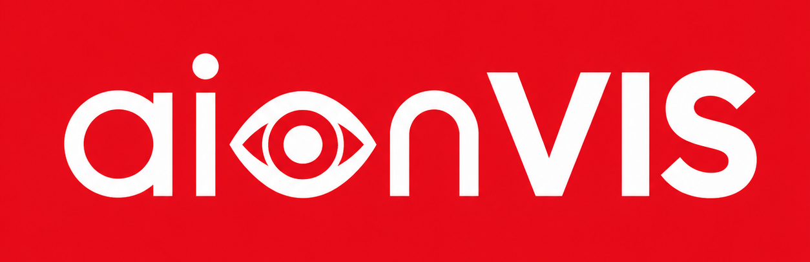
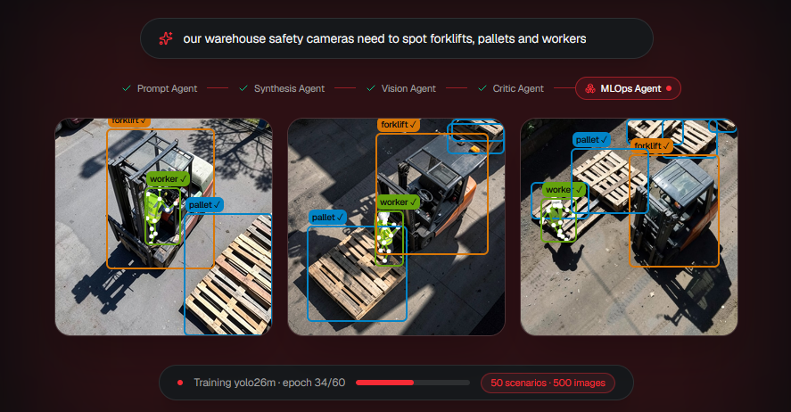
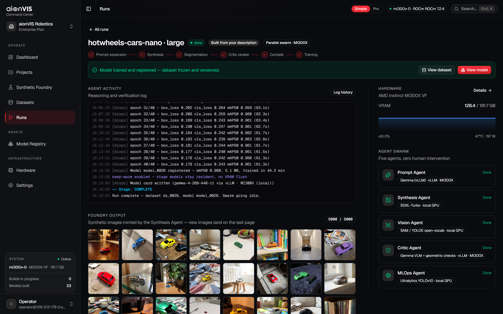
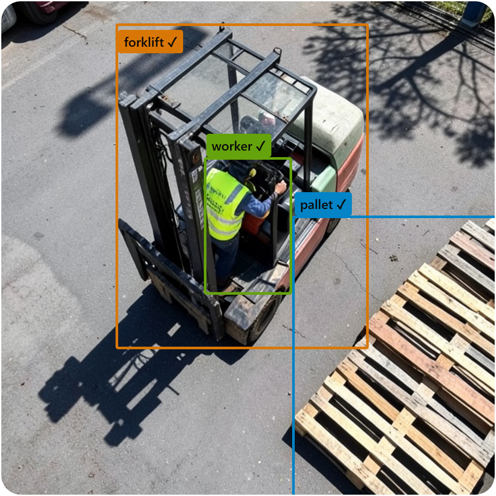
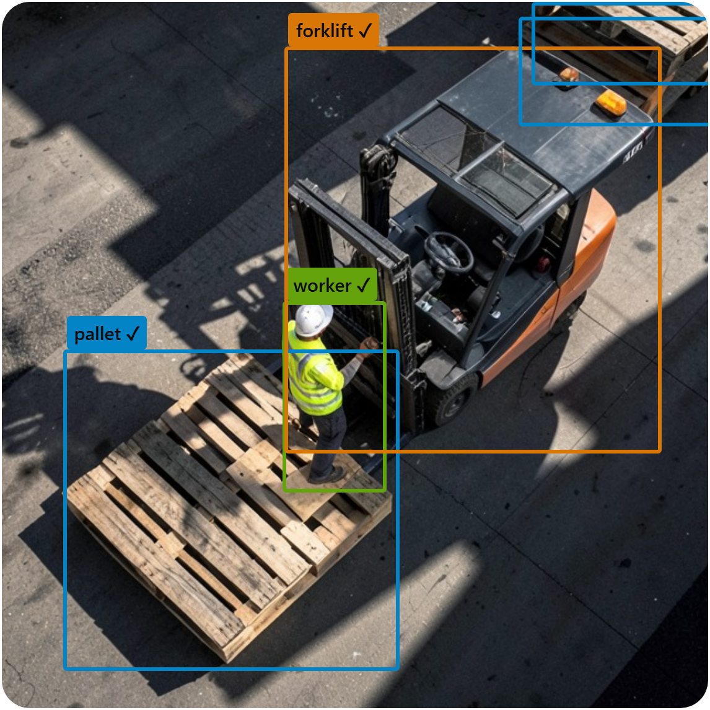

<p align="center">
  
</p>

<p align="center">
  <strong>One sentence in, deployable detection model out. Zero human labeling.</strong>
</p>

<p align="center">
  
</p>

<p align="center">
  <em>The whole product in one frame: a user types what the model is <strong>for</strong>, the swarm
  designs the scenes, generates them, labels them, verifies its own labels, and trains
  the detector.</em>
</p>

<p align="center">
  <a href="https://aionvis.com">Live demo</a> ·
  <a href="https://aionvis.com/idea.pdf">Pitch deck</a> ·
  <a href="docs/HOSTING_GUIDE.md">Run it on your own MI300X</a>
</p>

**Contents** ·
[What the swarm produces](#what-the-swarm-produces) ·
[Measured on one MI300X](#measured-on-one-amd-instinct-mi300x) ·
[Setup](#setup-three-ways-in-easiest-first) ·
[AMD resource usage](#amd-resource-usage) ·
[Market & business model](#market--business-model) ·
[Main code path](#main-code-path) ·
[External services](#external-services) ·
[Model lineup](#model-lineup-every-weight-is-open) ·
[License](#license)

aionVIS is an autonomous agent swarm for **computer vision**. It generates its
own training data, labels it, verifies its own labels, and trains deployable
**object-detection** models, natively on AMD hardware.
Built for the **AMD Developer Hackathon ACT II (Unicorn Track)**, and entered
in the **Best Use of Gemma Models** challenge: Gemma 4 is the swarm's brain.
It designs the scenes, spot-checks every label as a VLM, and writes each
model's card.

Every image, every label and every model in this repo was produced on a single
**AMD Instinct MI300X** (192 GB HBM3, ROCm 7.2.4) on the **AMD Developer Cloud**.
The LLM is self-hosted on the same card, with no third-party AI API.
[How the MI300X is used →](#amd-resource-usage)

**Proof from the live node:** 500 synthetic images → trained detector at **mAP50
0.764** in **~38 min** for **~$1.25** of MI300X time, with zero human labels.

**▶ [aionvis.com](https://aionvis.com)**: point the console at a live MI300X node
(endpoint URL + API key) and it drives the real swarm: live ROCm telemetry, real
runs, real training. No node handy? **"Explore with simulated data"** opens the
same console on an in-browser simulation: every screen, no account, no GPU.

| Agent | Model | Runs on |
|---|---|---|
| **Prompt** | Gemma 4 26B-A4B MoE | vLLM on MI300X |
| **Synthesis** \* | FLUX.2-klein / SDXL | diffusers on ROCm |
| **Vision** \* | SAM 3 concept segmentation / YOLOE zero-shot | PyTorch on ROCm |
| **Critic** \* | geometric self-check + Gemma 4 VLM spot-check | vLLM on MI300X |
| **MLOps** | YOLO / RT-DETR / RF-DETR training | PyTorch on ROCm |

**\* The three starred agents run at the same time.** On a single MI300X the swarm
is a **parallel pipeline**: synthesis, vision and critic overlap as
producer/consumer streams with every model resident in the 192 GB of VRAM at
once, with no load/unload churn. Training joins once the streams drain.

## What the swarm produces



*The console on a live MI300X node: five agents, the training log streaming
epoch by epoch, live VRAM telemetry, and the 5,000 images the swarm generated
for this run. All from one sentence: "I need to detect hotwheels cars (toy
cars) in my house".*

| | |
|---|---|
|  |  |

*Two of the 500 FLUX.2-generated images from the flagship run: auto-labeled by
SAM 3, every box verified by the Critic Agent (geometry + Gemma 4 VLM). No
human drew or reviewed a single label. 22,718 were accepted this way, 42,214
rejected.*

## Measured on one AMD Instinct MI300X

Two runs off the live node. No human drew, reviewed or corrected a single
label in either.

| | Warehouse safety | Hot Wheels (toy cars) |
|---|---|---|
| Synthetic images | 500 | 5,000 |
| Labels the Critic kept / threw out | 22,718 / 42,214 | 6,027 / 3,273 |
| Detector | yolo26m, 60 epochs @ 1024 px | yolo26n, 40 epochs |
| Accuracy | **mAP50 0.764** · mAP50-95 0.611 | **mAP50 0.960** · mAP50-95 0.946 |

The warehouse dataset is the hard one: dense aisles, ~45 instances per image.
The Hot Wheels model was then shown a **real phone photo of a real toy car it
had never seen** and found it at 99% confidence: synthetic training, real-world
inference.

## Setup: three ways in, easiest first

### 1 · Zero install (recommended first look)

Open **[aionvis.com](https://aionvis.com)** → *Launch console* → **"Demo
without AMD Developer Cloud"**. The console runs on an in-browser mock (MSW):
every screen, wizard, dataset view and a full simulated run work with no
backend and no GPU. If you have a live aionVIS node, attach it at runtime:
**Hardware → Connect AMD Developer Cloud → paste URL + API key**. All REST
and WebSocket traffic switches to the real node instantly.

### 2 · Run the console locally: two commands, no GPU, no config

```bash
cd aionvis-ui
npm install && npm run dev     # → http://localhost:3000
```

Node 22+. Mock mode is the **default** (no `.env` needed), the same experience
as option 1, served locally. Verified on a clean Windows machine.

### 3 · The real thing: full swarm on an AMD MI300X

**→ Step-by-step guide: [`docs/HOSTING_GUIDE.md`](docs/HOSTING_GUIDE.md)**
covers droplet creation, Hugging Face gating and TLS, with the traps we hit
live called out. Short version, in `tmux` (closing your SSH session otherwise
kills the backend):

```bash
# on the node (AMD Developer Cloud MI300X, ROCm):
git clone https://github.com/0xAthkot/aionvis && cd aionvis
bash backend/deploy_mi300x.sh   # ROCm torch + SAM 3 sidecar + streaming .env;
                                # mints your API key, prints the vLLM command

# pane 1: the backend
cd backend && source .venv/bin/activate
uvicorn app.main:app --host 0.0.0.0 --port 8000

# pane 2: paste the vLLM `docker run` the script printed (serves Gemma 4)
# pane 3: preflight every endpoint, the LLM and live inference
cd backend && .venv/bin/python smoke_test.py
```

Then attach any console (option 1 or 2, mock mode is fine): **Hardware →
Connect AMD Developer Cloud → paste the URL + key**. The *hosted* console can
only call an HTTPS node (browser mixed-content rule), so give the droplet TLS
first: sslip.io + Caddy, 5 minutes, [guide, step 6](docs/HOSTING_GUIDE.md).

**SAM 3's checkpoint is gated on Hugging Face.** Request access, or pick
**YOLOE** as the labeler in the wizard (a per-run choice, and the no-account
path). A `sam3` run on a node without it is rejected with the reason; aionVIS
never substitutes a model behind your back. Without vLLM the Prompt Agent falls
back to its deterministic template designer and the semantic critic is skipped;
runs still complete end to end.

### Alternative · Docker (CPU-only reference stack)

```bash
docker compose up --build
# UI → http://localhost:3000   API → http://localhost:8000/docs
```

Defaults are CPU-only so it runs anywhere: slow diffusion, but everything is
real. Optional LLM: point `LLM_BASE_URL` in `.env` at any OpenAI-compatible
endpoint; without one the swarm degrades gracefully to deterministic
fallbacks (runs still complete).

## AMD resource usage

Everything in this repo was built, measured and trained on AMD. No third-party
LLM APIs (no OpenAI/Fireworks keys), no other accelerator anywhere in the
pipeline.

| AMD resource | How aionVIS uses it |
|---|---|
| **AMD Instinct MI300X** (AMD Developer Cloud droplet, $2/h) | The only compute in the project: synthesis, labeling, verification and training all run here |
| **ROCm 7.2.4 + PyTorch-on-ROCm** | FLUX.2 / SDXL diffusion, SAM 3 segmentation, YOLO / RT-DETR / RF-DETR training |
| **vLLM ROCm container** (`vllm/vllm-openai-rocm:v0.23.0`) | Serves **Gemma 4 26B-A4B-IT** (MoE, 4B active) at `--gpu-memory-utilization 0.50` for scene design, the semantic critic and model cards |
| **192 GB HBM3** | Holds the *entire* agent swarm resident at once, **125 GB measured warm** |

**The MI300X-specific capability the project is built around:** 192 GB lets the
whole swarm stay resident. Gemma 4 (~96 GB) + FLUX.2 (~13 GB) + SAM 3/YOLOE
(~8 GB), measured at **125 GB warm**, leaving ~67 GB free for training.
Streaming mode overlaps synthesis, vision and critic on the one card
(`PIPELINE_MODE=streaming`, `GPU_SLOTS=4`, `AUTO_BATCH=true`); an 80 GB card
cannot co-reside this stack. Live VRAM telemetry is on the console's Hardware
page.

### Why we moved off a hosted LLM API

The first prototype reached Gemma through **Fireworks AI**, because we had no
GPU large enough to serve a 26B model ourselves. Once the MI300X was available
we dropped the hosted API and moved Gemma 4 **on-card**: 192 GB of HBM3 is
enough to serve the LLM under vLLM *and* keep FLUX.2, SAM 3 and the trainer
resident beside it, so the semantic critic became a local call instead of a
per-image network round trip to a third party. The Fireworks integration was
removed on 2026-07-08; today no part of the swarm leaves the AMD card.

## Market & business model

Labeling is a multi-billion-dollar industry that exists only because models
can't feed themselves. At scale a box costs **$0.03–$0.10** to draw, so a
modest 100k-image dataset runs **$50k+** with QA, and you pay again every
time the camera angle or the product changes. The flagship run above cost
**$1.25** and nobody drew a box.

Pricing follows the cost: usage-based per GPU-minute (every run is metered
and quoted in the wizard before launch) plus a per-seat platform fee. A
500-image run is minutes of MI300X time, sellable at $5–15 with healthy
margin. One engine serves eight vision markets, each in the billions:
logistics ($22B), manufacturing ($20B), automotive ($19B), retail ($18B),
agriculture ($18B), aviation ($12B), defense ($9.3B), robotics ($4.4B).

| | Data source | Labels | Human in the loop |
|---|---|---|---|
| Scale AI · Labelbox | yours | humans | always |
| Roboflow · Ultralytics | yours | AI-assisted | yes |
| Synthetic-data studios | artists build scenes | rendered | artists |
| **aionVIS** | **generated from a sentence** | **self-verified by agents** | **no** |

Synthetic data is easy to generate and hard to trust; the self-correcting
Critic is the moat: we ship the trust layer. Roadmap: seed raise → paid
design-partner pilots → commercial launch. Full pitch: [`PITCH.md`](PITCH.md).

## Main code path

Follow one run through the system:

| Step | Where |
|---|---|
| `POST /api/v1/runs` | [`backend/app/routers.py`](backend/app/routers.py) |
| Orchestration (sequential + streaming modes) | [`backend/app/orchestrator/pipeline.py`](backend/app/orchestrator/pipeline.py) |
| 1 · Use case → scene prompts (Gemma, or deterministic fallback) | [`backend/app/agents/prompt_agent.py`](backend/app/agents/prompt_agent.py) |
| 2 · Image synthesis (FLUX.2 / SDXL) | [`backend/app/agents/synthesis_agent.py`](backend/app/agents/synthesis_agent.py) |
| 3 · Open-vocab labeling (SAM 3 sidecar / YOLOE) | [`backend/app/agents/vision_agent.py`](backend/app/agents/vision_agent.py), [`sam3_bridge.py`](backend/app/agents/sam3_bridge.py) |
| 4 · Label verification (pure-numpy geometry + Gemma VLM) | [`backend/app/agents/critic_agent.py`](backend/app/agents/critic_agent.py), [`geometry.py`](backend/app/agents/geometry.py), [`semantic_critic.py`](backend/app/agents/semantic_critic.py) |
| 5 · Dataset compile → training → export → model card | [`dataset_compiler.py`](backend/app/agents/dataset_compiler.py), [`mlops_agent.py`](backend/app/agents/mlops_agent.py), [`model_card.py`](backend/app/agents/model_card.py) |

The API surface is **contract-first**:
[`aionvis-ui/BACKEND_CONTRACT.md`](aionvis-ui/BACKEND_CONTRACT.md) documents
every endpoint; [`aionvis-ui/src/lib/api/types.ts`](aionvis-ui/src/lib/api/types.ts)
and [`backend/app/schemas.py`](backend/app/schemas.py) are 1:1 mirrors, and the
UI's in-browser mock ([`aionvis-ui/src/lib/mocks/handlers.ts`](aionvis-ui/src/lib/mocks/handlers.ts))
implements the same contract, which is why the console runs identically with
or without a backend.

| Part | What it is |
|---|---|
| [`aionvis-ui/`](aionvis-ui/README.md) | Next.js 16 console: wizard, live Mission Control, dataset analytics, model registry + comparison, inference playground |
| [`backend/`](backend/README.md) | FastAPI + the agent swarm |

Nothing here is mocked on the backend: every number in the results table came
off the MI300X droplet. Check it yourself with
[`backend/smoke_test.py`](backend/smoke_test.py) (preflights every endpoint,
the LLM and live inference) and the 32 pytest cases in
[`backend/tests/`](backend/tests), covering auth, streaming orchestration, mask
geometry, prompt agent, and generator/labeler selection.

## External services

All models are open-weight and self-hosted; the only services involved:

| Service | Role | Notes |
|---|---|---|
| **AMD Developer Cloud** | MI300X droplet the swarm runs on ($2/h) | The only compute used |
| **Vercel** | Hosts the demo console ([aionvis.com](https://aionvis.com)) | Frontend only; runs on the in-browser mock until you attach a node |
| **sslip.io** | Zero-signup wildcard DNS: `<your-droplet-ip-dashed>.sslip.io` → the droplet IP | Gives Caddy a hostname so Let's Encrypt can issue a cert; no account, stores nothing |
| **Caddy + Let's Encrypt** | TLS proxy on the droplet (REST + WebSockets) | Required: the HTTPS console cannot call plain `http://`/`ws://` (mixed content) |
| **Hugging Face** | Model weights, downloaded on first use | `facebook/sam3` is gated: request access on its model page and `huggingface-cli login`; check each model page for license acceptance |
| **GitHub** | This repo | n/a |

**No third-party LLM/API services.** The language model is Gemma 4 served by
vLLM on the same MI300X; there are no OpenAI, Anthropic or Fireworks keys
anywhere in the stack
([why we moved off a hosted API](#why-we-moved-off-a-hosted-llm-api)). The
backend's own API is protected by a self-minted `AA_API_KEY`
(Bearer / X-API-Key / WebSocket `?token=`).

## Model lineup: every weight is open

| Stage | Model | License |
|---|---|---|
| Scene design + semantic critic | google/gemma-4-26B-A4B-it (MoE, vLLM) | Apache-2.0 |
| Synthesis | black-forest-labs/FLUX.2-klein-4B (or SDXL) | Apache-2.0 (OpenRAIL++) |
| Auto-labeling | facebook/sam3 (or YOLOE) | SAM License / AGPL-3.0 |
| Trainable detectors | YOLOv10/11/26 · RT-DETR · RF-DETR | AGPL-3.0 · Apache-2.0 (RF-DETR) |

Model choices are the user's and are honored verbatim. A node that can't
run the selected generator or labeler **rejects the run with setup steps**
instead of silently substituting. 22 trainable architectures across 5 task
types (detect · segment · OBB · pose · classify); exports to .pt, ONNX,
TorchScript, OpenVINO and YOLO/COCO/VOC/CSV datasets.

SAM 3 and RF-DETR need `transformers>=5`, which conflicts with the pinned SDXL
stack, so each runs in an isolated venv behind a worker process.
`deploy_mi300x.sh` builds the SAM 3 sidecar for you; RF-DETR is opt-in. Setup
commands: [`backend/README.md`](backend/README.md#isolated-model-runtimes-sidecars).

## License

MIT. See [LICENSE](LICENSE). Third-party models and libraries keep their
own licenses (table above).
